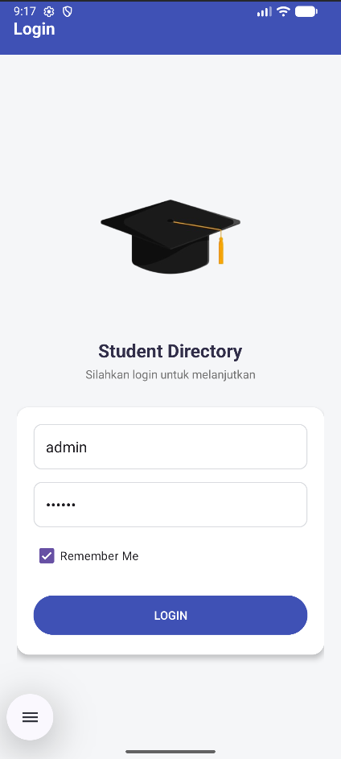
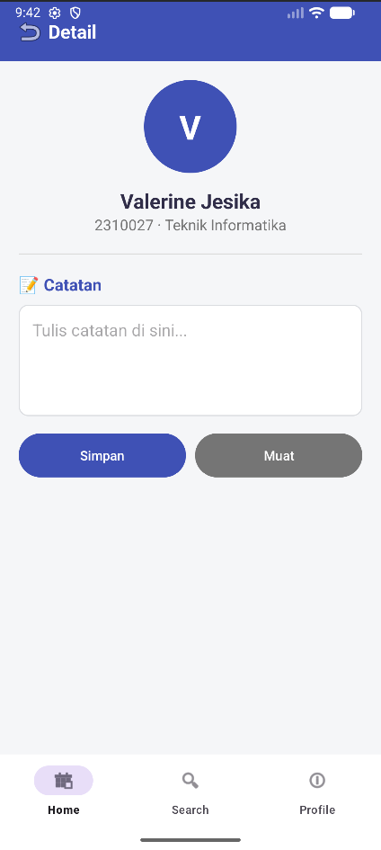
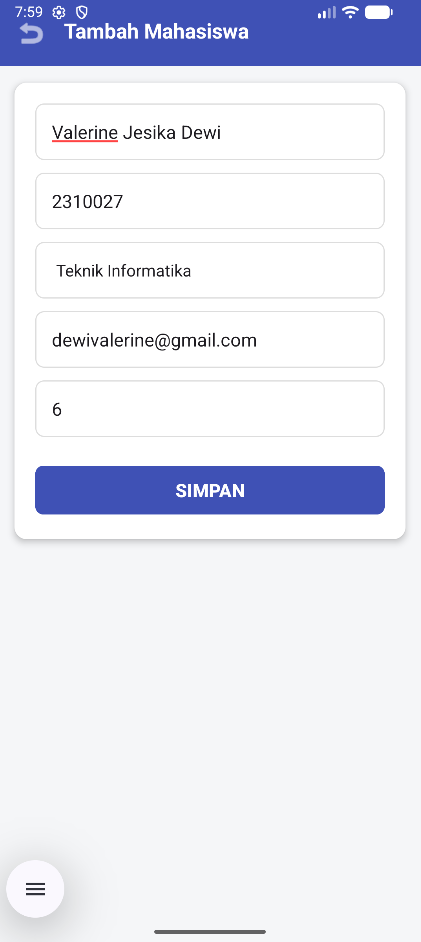
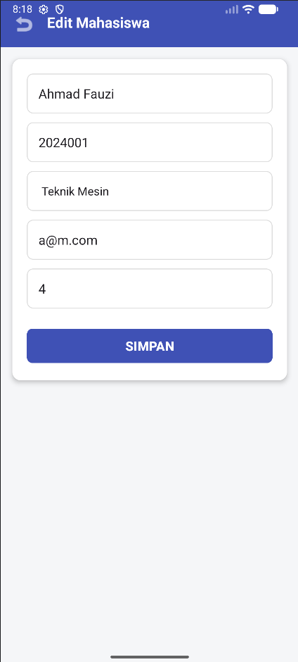
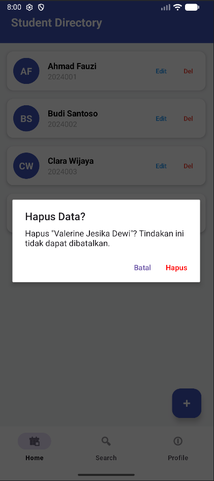
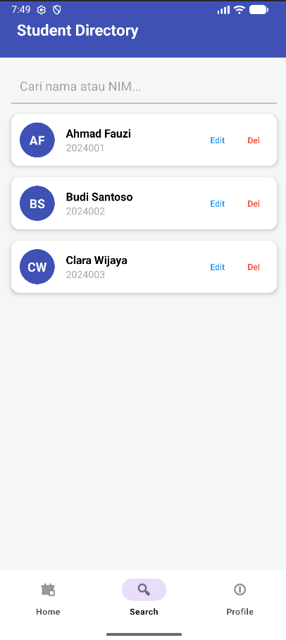
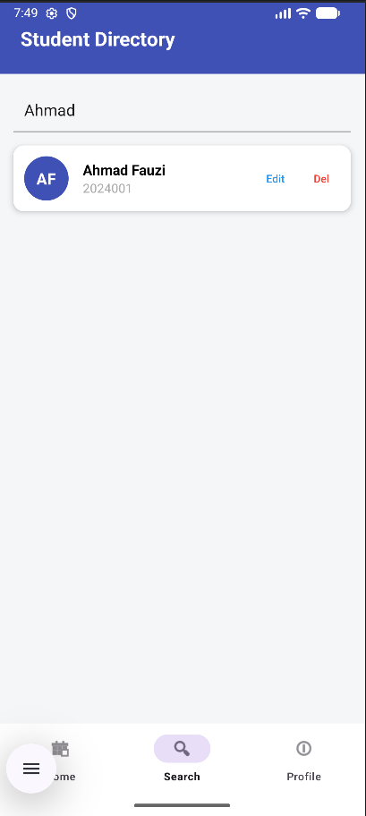
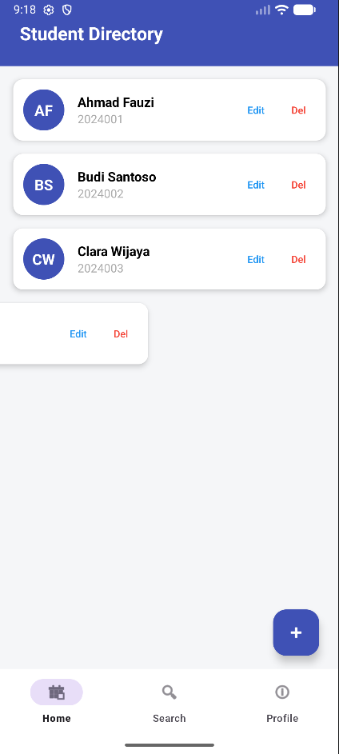

# Student Directory App - Room Database CRUD

Aplikasi manajemen data mahasiswa berbasis Android yang mengimplementasikan arsitektur modern dan penyimpanan data lokal yang efisien.

## 👤 Identitas Pengembang
*   **Nama:** [Valerine Jesika Dewi]
*   **NIM:** [F1D02310027]

## 📝 Deskripsi Singkat
**Student Directory** adalah aplikasi Android yang dirancang untuk membantu pengelolaan data mahasiswa. Aplikasi ini memungkinkan pengguna untuk melihat daftar mahasiswa, mencari data, menambah, mengedit, hingga menghapus informasi mahasiswa. Selain itu, aplikasi ini dilengkapi dengan fitur catatan personal untuk setiap mahasiswa yang disimpan secara lokal.

## 📸 Screenshots
Berikut adalah tampilan utama dari aplikasi Student Directory:

| Login Page | Home Page (Daftar) |
|---|---|
|  |  |

| Detail Page | Form Tambah |
|---|---|
|  |  |

| Form Edit | Hapus |
|---|---|
|  |  |

| Search | Hasil Search |
|---|---|
|  |  |

| Swipe to Delete |
|---|
|  |

## 💾 Metode Penyimpanan Data
Aplikasi ini menggunakan dua metode penyimpanan data yang berbeda sesuai dengan fungsinya:

1.  **Room Database (SQLite):**
    *   **Kegunaan:** Menyimpan data utama mahasiswa (Nama, NIM, Prodi).
    *   **Alasan:** Room menyediakan abstraksi di atas SQLite yang memungkinkan manajemen database lebih mudah, aman dari error penulisan query, dan mendukung operasional asinkron (Coroutines) untuk menjaga performa UI.

2.  **Internal Storage (File .txt):**
    *   **Kegunaan:** Menyimpan fitur "Catatan" pada halaman Detail Mahasiswa.
    *   **Alasan:** Menggunakan `openFileOutput` dan `openFileInput` untuk menyimpan data teks dalam bentuk file fisik. Hal ini dipilih untuk memisahkan data profil yang terstruktur dengan data catatan yang bersifat lebih dinamis dan berbasis teks panjang.

3.  **SharedPreferences:**
    *   **Kegunaan:** Menyimpan sesi login (PrefManager).
    *   **Alasan:** Efisien untuk menyimpan data sederhana seperti status login (boolean) agar pengguna tidak perlu login berulang kali saat aplikasi dibuka kembali.

## ⚠️ Kendala dan Solusi
Selama pengembangan aplikasi, terdapat beberapa kendala teknis yang berhasil diatasi:

*   **Kendala 1: Navigasi Bottom Menu Tidak Muncul**
    *   *Penyebab:* ID pada file menu XML tidak sinkron dengan ID fragmen di `nav_graph.xml`.
    *   *Solusi:* Menyamakan seluruh ID pada file menu dengan ID destinasi di Navigation Graph sehingga `setupWithNavController` dapat bekerja otomatis.

*   **Kendala 2: Error Null saat Mengirim Data ke Detail**
    *   *Penyebab:* Pengiriman ID mahasiswa melalui Bundle seringkali tidak terbaca jika fragmen tujuan belum siap.
    *   *Solusi:* Menggunakan penanganan `arguments?.getInt()` dengan nilai default dan memastikan ID dikirim dengan benar dari Adapter melalui Navigation Action.

*   **Kendala 3: Layout Pecah pada Layar Kecil**
    *   *Penyebab:* Penggunaan padding yang terlalu besar pada CardView.
    *   *Solusi:* Mengoptimalkan penggunaan `LinearLayout` dengan `weight` dan menggunakan `ScrollView` agar halaman tetap dapat diakses di berbagai ukuran layar.
